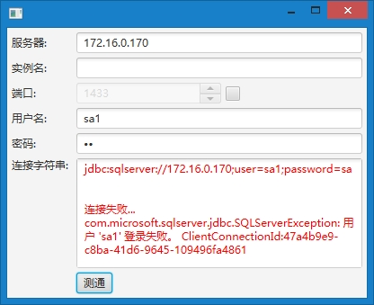
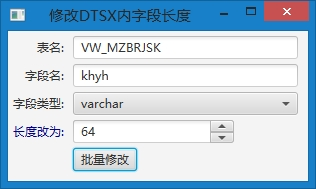
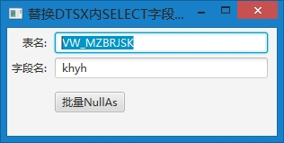

# ODS实施改进

## 运行环境

- JRE1.8+

## 功能清单

- 生成ODS配置文件
- 分析业务库到ODS库差异报告
- 批量修改业务库字段短于ODS库的字段长度及这些字段在DTSX中的长度定义

## 问题处理

如果运行下述工具过程中出现问题请:

1. 检查logs路径下对应的*.html日志文件, 根据警告或错误信息来修改程序运行环境

2. 如果仍然不能解决问题，请将logs目录打包, 随问题描述和截图发往有关人员

- 日志级别说明:
	- DOS窗口输出程序操作结果, 是INFO级别日志
	- logs目录下的*.html日志输出程序进行的主要操作记录, 是DEBUG级别日志

## 相关SQL指令

1. 改表字段长度:

    //将表ZY_BRSYK中字段pzh2最大长度设为32

    alter table ZY_BRSYK alter column pzh2 varchar(32);

2. 添加TimeTemp字段语句:

    //为表CPOE_CQYZK加入TIMETEMP字段:

    if not exists(select 1 from syscolumns where name='TIMETEMP' and id=OBJECT\_ID('CPOE\_CQYZK'))
     alter table CPOE_CQYZK add TIMETEMP rowversion
    GO

## 操作指南

1. 命令行窗口键入命令检查系统已经安装jre环境在1.8版本以上

    java -version
	> 如果该命令执行没有提示任何有关java的版本信息，请根据"我的电脑-属性"查看Windows操作系统类型。如果是64位的请安装[64位JRE8](http://103.38.233.24:8080/tools/jre-8u131-windows-x64.exe "jre-8u131-windows-x64.exe"), 如果是32位请安装[32位JRE8](http://103.38.233.24:8080/tools/jre-8u131-windows-i586.exe "jre-8u131-windows-i586.exe")。可直接从[Oracle官方网站](http://java.oracle.com)下载最新版JRE。

2. 配置config/etlDatabase.xml文件，设定数据库的服务器、端口、用户名、密码、实例名、数据库名

3. 执行功能

    - **生成配置文件:**

        - 运行**"dtsx生成配置文件.bat"**
        - 生成的ODS配置文件位于当前路径下生成的ConfigFile/ODS目录下

    - **字段差异分析:**

	    - 运行**"ods字段检查.bat"**分析业务库到ODS库字段差异报告
	    - 报告的结果会生成到数据库
	    - 当前目录下会产生report.csv包含差异分析结果

    - **批量修正字段长度问题:**

        - 运行**"dtsx修正字段长度.bat"**该程序会执行:
            - 对比源库与目标库已定义表的字段长度
            - 当目标库的字段长度小于源库中的表时, 修改表中该字段的长度
            - 修改当前路径下,该表名.dtsx文件中使用到该字段的长度为源表定义的长度
    -  **批量修正业务系统缺字段，字段NullAs问题:**
    		
		- 运行**"dtsx修正字段NullAs.bat"**该程序会执行:
            - 对比源库与目标库已定义表的字段缺失
            - 当源库缺少目标库定义的字段时，源库的DTSX中"select fieldName"语句改为"select null as fieldName ..."模式

## 附带界面工具

- SQLServer测通工具:

	- 第一步: 运行"SQLServer测通工具.bat", 获得如下界面:
	
	
	- 第二步: 至少输入服务器名、用户名、密码，点击"测通"按钮进行JDBC到数据库的连接测试
		- 如果连接成功，显示蓝色成功信息
		- 如果连接失败，显示红色错误信息
		- 如果不能诊断错误原因，请将错误信息或截图发有关人员
>注意：SQLServer在使用非默认实例时端口可能不是1433，此时应保持端口输入框是非可用状态。除非您清楚知道正确的端口号码是多少，可以勾选端口输入框后的复选框，并输入正确的端口号。

- DTSX字段长度批量修改工具：

    - 运行**"dtsx_字段长度.bat"**, 看到如下界面: 
        
        - 输入表名、字段名、字段类型、目标长度
        - 点击"批量修改"按钮，该程序会寻找当前路径下所有该表名大写的dtsx文件，并替换其中的指定字段长度为目标长度

- DTSX字段替换为NULL AS工具:

    - 运行**"dtsx_字段NullAs.bat"**, 看到如下界面: 
        
        - 输入表名、字段名
        - 点击"批量NullAs"按钮，该程序会寻找当前路径下所有该表名大写的dtsx文件，并替换其中的Select语句中该字段的选择语句为'NULL AS [fieldName]',解决当源数据库中缺少字段，导致报错的问题

## 开发环境

- JDK1.8+
- intellij 2016.2.5
- maven 3.3

## 历史版本

- v1.3-20170628 增加DTSX的字段NullAs编辑工具
- v1.2-20170627 集成配置文件生成功能，日志采用html形式显示
- v1.1-20170620 实现根据业务库与ODS库字段对比，获得的长度不兼容字段信息，自动修改dtsx文件和ODS库对应字段长度
- v1.0-20170616 实现业务库与ODS库字段对比（缺失、类型不兼容、长度不兼容）功能

## BUG提供与修正

- 20170623<DTSX字段差异修正工具>:

	- dtsx修改后导致中文乱码
	- 日志在默认级别仅保留修改了哪个文件的哪个字段
	- 数值输入组件需要输入回车才能确定数值，改为输入时确定
	- readme.html中增加提示修改文件只读属性为否
 